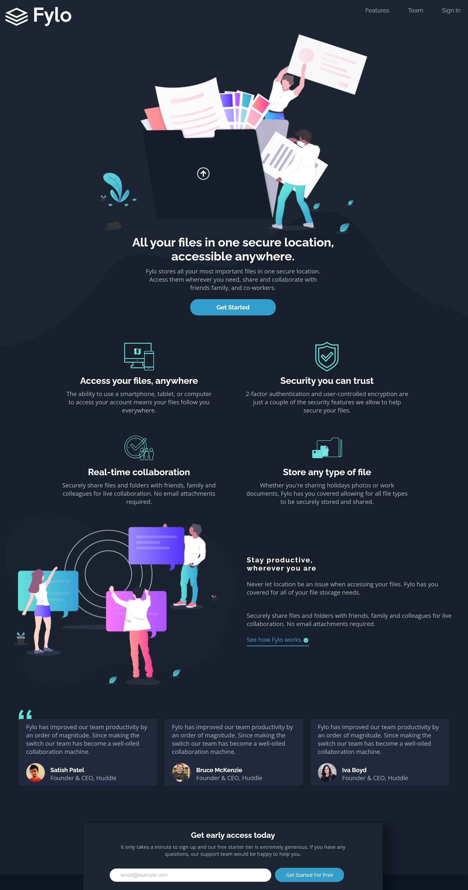

# Frontend Mentor - Fylo dark theme landing page solution

This is a solution to the [Fylo dark theme landing page challenge on Frontend Mentor](https://www.frontendmentor.io/challenges/fylo-dark-theme-landing-page-5ca5f2d21e82137ec91a50fd). Frontend Mentor challenges help you improve your coding skills by building realistic projects. 

## Table of contents

- [Overview](#overview)
  - [The challenge](#the-challenge)
  - [Screenshot](#screenshot)
  - [Links](#links)
- [My process](#my-process)
  - [Built with](#built-with)
  - [What I learned](#what-i-learned)
  - [Continued development](#continued-development)
  - [Useful resources](#useful-resources)
- [Author](#author)


## Overview

### The challenge

Users should be able to:

- View the optimal layout for the site depending on their device's screen size
- See hover states for all interactive elements on the page

### Screenshot




### Links

- Solution URL: [Add solution URL here]
- Live Site URL: [https://ot-charlie.github.io/Fylo-landing-page/]
## My process

### Built with

- Semantic HTML5 markup
- CSS custom properties
- Flexbox
- CSS Grid
- Desktop-first workflow

### What I learned


```css
main {
  background-image: url("./images/bg-curvy-desktop.svg"),
    linear-gradient(
      to bottom,
      transparent 850px,
      /* transparent at top till 860px*/ hsl(218, 28%, 13%) 850px
        /* color starts at 860px */
    );
  background-size: 100% auto; /*full width and auto height scales proportionally*/
  background-position: center 25%; /* horizontally centered and 25% from the top*/
  background-repeat: no-repeat;
}
```


### Continued development
I want to keep getting better at building websites. In particular I want to work on my speed and also learn how to replicate pixel perfect designs.


### Useful resources

- [Claude AI] - Was really helpful in assiting me debug and find out what was wrong with my code.


## Author

- Website - [Onwuli ](https://onwuli-charles-netlify.app)
- Frontend Mentor - [Ot.Charlie](https://www.frontendmentor.io/profile/ot.charlie)
- Twitter - [Kingcharlie02](https://www.twitter.com/kingcharlie01)


